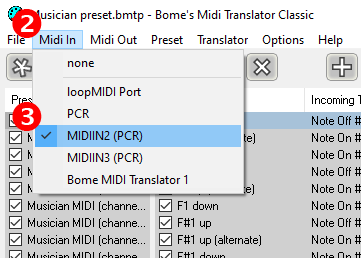
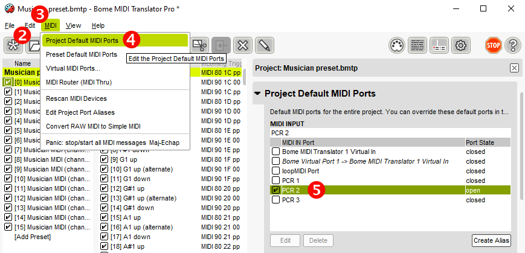
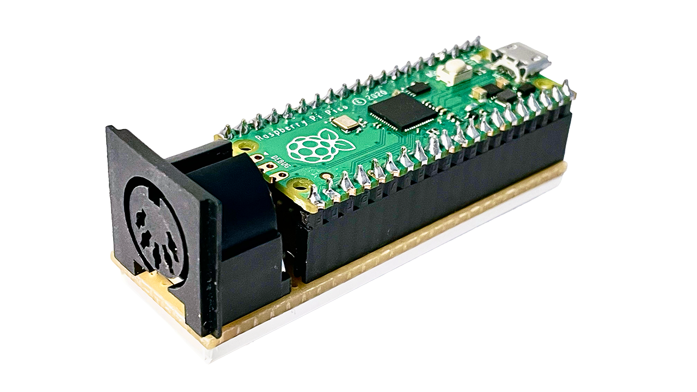
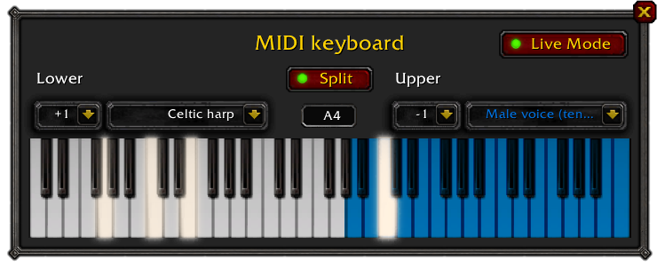
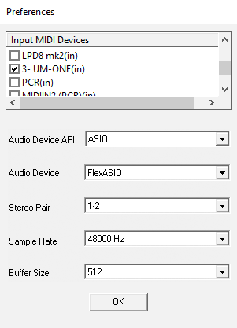
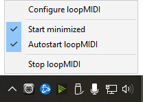
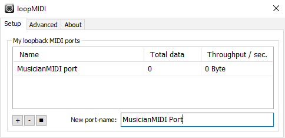
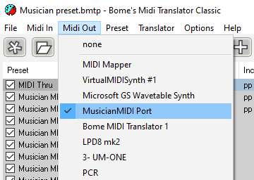
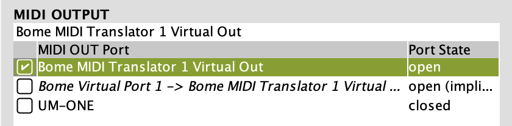

# Musician MIDI
Play live with Musician using a MIDI keyboard.

## Table of contents

- [How it works](#how-it-works)
- [Choosing the translator](#choosing-the-translator)
- [Setting up the translator](#setting-up-the-translator)
  - [Solution 1: Bome MIDI Translator Classic](#solution-1-bome-midi-translator-classic)
  - [Solution 2: Bome MIDI Translator Pro](#solution-2-bome-midi-translator-pro)
  - [Solution 3: Musician MIDI Pico Translator](#solution-3-musician-midi-pico-translator)
- [Configuration for macOS](#configuration-for-macos)
  1. [Function keys configuration](#1-function-keys-configuration)
  2. [Permissions](#2-permissions)
- [How to play](#how-to-play)
- [Deal with audio delay](#deal-with-audio-delay)
  - [Using a hardware synthesizer](#using-a-hardware-synthesizer)
  - [Using a software synthesizer](#using-a-software-synthesizer)
    1. [Install Sforzando](#1-install-sforzando)
    2. [Install FlexASIO *(optional, Windows only)*](#2-install-flexasio-optional-windows-only)
    3. [Configure Sforzando](#3-configure-sforzando)
    4. [Configure MIDI thru *(optional)*](#4-configure-midi-thru-optional)
    5. [Play!](#5-play)

## How it works

There is no possible way to use MIDI in World of Warcraft. The trick is to *translate* the MIDI note events that come from your MIDI controller into PC keyboard keystrokes, that can then be captured by the add-on interface.

The translator can be either:
* a **third party application** that runs on your computer and emulates a PC keyboard

	or
* a **custom MIDI interface** that connects directly to your MIDI controller using a 5-pin DIN connector on one side, and to your computer as a standard USB PC keyboard on the other side.

## Choosing the translator

There are 3 translator solutions available to you, each of them having their pros and cons. It's up to you to choose the most suitable for you:
1. [Bome MIDI Translator Classic](https://www.bome.com/products/mtclassic) : recommended solution if you play on **Windows** and already have a standard MIDI interface or USB MIDI controller. It's simple to configure and easy to use. It's a charged program for commercial use (29 €) but you can use it for free without any limitation (remember WinRAR).
2. [Bome MIDI Translator Pro](https://www.bome.com/products/miditranslator) : recommended solution if you play on **macOS** and already have a standard MIDI interface or USB MIDI controller. As for the classic version, it's simple to configure and easy to use but it's quite expensive (79 €). You can use the free trial version but you have to restart it every 20 minutes.
3. [Musician MIDI Pico Translator](https://github.com/LenweSaralonde/musician-midi-pico-translator) : Plug and play **DIY solution** for MIDI controllers with a **5-pin DIN MIDI output**. The parts are inexpensive (less than 10 €) and easy to source from online and local retailers. The building process is straightforward and just requires basic tools such as soldering iron. It's recognized by the computer as a standard USB keyboard so no additional software or driver is required. It also includes a MIDI to USB interface that can be used with music production software or a software synthesizer to [mitigate the audio delay issue](#deal-with-audio-delay).

| | Solution | Type | OS | Price | Pros | Cons |
|---|---|---|---|---|---|---|
| 1. | [Bome MIDI Translator Classic](https://www.bome.com/products/mtclassic) | Software | Windows | 0 - 29 € | Free | Windows only |
| 2. | [Bome MIDI Translator Pro](https://www.bome.com/products/miditranslator) | Software | Windows / macOS | 79 € | Works on macOS | Expensive |
| 3. | [Musician MIDI Pico Translator](https://github.com/LenweSaralonde/musician-midi-pico-translator) | Hardware | Windows / macOS / Linux | < 10 € | Plug and play All-in-one Inexpensive | Basic DIY skills required 5-pin DIN connector only |

## Setting up the translator

This step-by-step guide will explain how to install and configure all the required software and hardware. It will also help you resolve the most common problems you may encounter.

> ⚠️ If you're running macOS, a few extra configuration steps are required regardless of the solution you chose. Check out the [Configuration for macOS](#configuration-for-macos) section when you're done.

> ⚠️ If you need a 5-pin DIN MIDI to USB interface to use with Bome MIDI Translator, make sure to use a quality product like the Roland [UM-ONE mk2](https://www.roland.com/global/products/um-one_mk2/) to avoid problems. Avoid the cheap off-brand models from Amazon and AliExpress.

Feel free to join our [Discord server](https://discord.gg/ypfpGxK) for further assistance.

### Solution 1: Bome MIDI Translator Classic

Download and install [Bome MIDI Translator Classic](https://www.bome.com/products/mtclassic).

1. Connect your MIDI controller.
2. Start **Bome MIDI Translator Classic**.
3. Open the `Musician preset.bmtp` file that is provided in the `Interface/AddOns/MusicianMIDI` folder.
4. Open the **Midi In** menu.
5. Select your MIDI input device.

	

### Solution 2: Bome MIDI Translator Pro

Download and install [Bome MIDI Translator Pro](https://www.bome.com/products/miditranslator).

1. Connect and turn on your MIDI controller.
2. Start **Bome MIDI Translator Pro**.
3. Open the `Musician preset.bmtp` file that is provided in the `Interface/AddOns/MusicianMIDI` folder.
4. Open the **MIDI** menu option then click **Project Default MIDI Ports**.
5. Select your **MIDI INPUT** device in the right column under **MIDI IN Port**.

	

### Solution 3: Musician MIDI Pico Translator

The [Musician MIDI Pico Translator](https://github.com/LenweSaralonde/musician-midi-pico-translator) is a DIY hardware plug and play MIDI to USB translator interface based on a [Raspberry Pi Pico](https://www.raspberrypi.com/products/raspberry-pi-pico/) board.

1. Plug it to your computer via USB and to your MIDI controller via the DIN port.
2. Done.

Check out the [dedicated project page](https://github.com/LenweSaralonde/musician-midi-pico-translator) to build your own.

## Configuration for macOS
If you're running macOS, a few extra configuration steps are required for your setup to work properly, regardless of the solution you chose.

### 1. Function keys configuration
Musician MIDI needs the function keys to be enabled. After following these steps, make sure there is no other system shortcut using them.

#### For macOS version 13 (Ventura) and later
1. Go to the **Apple** menu > **System Settings**.
2. Click the **Keyboard** section in the left menu (or type `keyboard` in the search box).
3. Click the **Keyboard Shortcuts…** button.
4. Click **Function Keys** in the left menu.
5. Enable **Use F1, F2, etc. keys as standard function keys**.
6. Click **Mission Control** in the left menu.
7. Uncheck the **Show Desktop** shortcut if the **F11** key is set (default).
8. Click **Done**.

#### For macOS version 12 (Monterey) and earlier
1. Go to the **Apple Menu** > **System Preferences** > **Keyboard**.
2. Go to the **Keyboard** tab.
3. Check **Use F1, F2, etc. keys as standard function keys**.
4. Go to the **Shortcuts** tab.
5. Click **Mission Control** and **uncheck** the **Show Desktop** shortcut if the **F11** key is set (default).

### 2. Permissions
> 💡 If you're using the **Musician MIDI Pico Translator** interface, you may skip this step.

Bome MIDI Translator Pro needs accessibility permissions to send keystrokes.

#### For macOS version 13 (Ventura) and later
1. Go to the **Apple** menu > **System Settings**.
2. Click the **Privacy & Security** section in the left menu (or type `security` in the search box).
3. Click **Accessibility**.
4. Enable **Bome MIDI Translator Pro**.
5. Validate using your system password or fingerprint.

#### For macOS version 12 (Monterey) and earlier
1. Go to **System Preferences** > **Security & Privacy**.
2. Click **Accessibility**.
3. Click the padlock 🔒 to allow modifications.
4. Check **MIDI Translator Pro** in the list.

## How to play

In WoW, open Musician's menu by clicking on the minimap icon then choose **Open MIDI keyboard** or type `/mus midi`. You can play live using your MIDI keyboard as long as the MIDI keyboard window is focused in game.

The keyboard can be split in 2 layers to set a different instrument and/or octave on each side. Click the **Split** button to activate split mode. To change the split point, click on the split point text field then press the piano key you want as a new split point.

The keyboard can also be activated by clicking the on-screen keyboard keys.

> ⚠️ Since Musician MIDI relies on computer keyboard keystroke emulation, almost all the keyboard keys will trigger a note, including Esc, Enter and the function keys. The MIDI keyboard window should remain open and the WoW application focused to work. Click the **X** button to close the MIDI keyboard.

The piano keyboard range goes from E1 (28) to G7 (103) which corresponds to a standard 76-key piano. Playing out of range keys has no effect.

## Deal with audio delay

> ⚠️ Using wireless headphones or speakers adds extra latency. It's recommended that you use wired ones to make music.

As with the built-in live keyboard interface, you may experience some delay between the moment you press a key and when the sound actually starts playing, which can be awkward for a live performance.

This problem is due to the fact that World of Warcraft is not a music production software and does not use low latency audio drivers.

The problem is more likely to occur on Microsoft Windows than on macOS because macOS was designed with music creation in mind but there is still a slight delay on macOS.

The solution is to use an external synthesizer for audio feedback, instead of relying on Musician.

### Using a hardware synthesizer
The easiest way to play live without audio delay is to use a keyboard that has its own tone generator, such as a digital piano or a synthesizer. You can mute Musician's audio using the minimap icon and refer to your actual instrument's audio for playing.

### Using a software synthesizer
If your MIDI keyboard is a controller only – or if you just want to play using Musician's instruments – you can run a software synthesizer on your computer along with your translator solution and use it for audio feedback.

#### 1. Install Sforzando
The best soft synth you may use is [Sforzando](https://www.plogue.com/products/sforzando.html) because it's free and it supports Musician's soundfonts.

#### 2. Install FlexASIO *(optional, Windows only)*
On Windows, you need an **ASIO driver** in order to run Sforzando with no audio delay.

If you don't already have one that comes with some music software installed on your PC such as FL Studio, you can download and install [FlexASIO](https://github.com/dechamps/FlexASIO/releases) which is free and open-source.

#### 3. Configure Sforzando
To avoid issues, close any program that uses audio and MIDI before starting, including WoW and Bome MIDI Translator.

1. Launch **Sforzando**.
2. Click **Tools** > **Preferences**.
3. Under **Input MIDI Devices**, check the one that corresponds to your MIDI keyboard.
4. For **Audio Device API**, select **ASIO** (Windows only).
5. For **Audio Device**, select your favorite ASIO driver such as **FlexASIO** or **FL Studio ASIO** (Windows only).
6. Select the smallest **Buffer Size** possible for minimal delay (256 or 512 is good).
7. Leave the other parameters default (Stereo pair 1-2 and 48KHz).

	

8. Click **OK**.
9. Drag and drop any `.sfz` file from Musician's `soundfonts` folder into Sforzando or click **Import**.
10. Try playing on your MIDI keyboard, you should hear music.
11. Launch **Bome MIDI Translator** if using it.
12. Open a text editor such as Windows' Notepad. Play some notes around the middle C on your MIDI keyboard, it should type down letters in the text editor while you hear your instrument playing.

> ⚠️ If you get an error message such as **Cannot open MIDI input device**, this means your MIDI device can't be used simultaneously in 2 applications. Check the [Configure MIDI thru](#4-configure-midi-thru-optional) section below to resolve this.

#### 4. Configure MIDI thru *(optional)*
Your MIDI controller may not be usable on several applications at the same time. In this case, the trick is to configure Bome MIDI Translator to duplicate the incoming MIDI messages from your controller to Sforzando.

* [Instructions for Bome MIDI Translator Classic (Windows only)](#using-bome-midi-translator-classic-windows-only)
* [Instructions for Bome MIDI Translator Pro](#using-bome-midi-translator-pro)

##### Using Bome MIDI Translator Classic (Windows only)

1. Download and install [loopMIDI](https://www.tobias-erichsen.de/software/loopmidi.html).
2. Launch **loopMIDI**.
3. Right click on the loopMIDI tray icon  then check **Start minimized** and **Autostart loopMIDI** so you won't have to take care of it in the future.

	 

4. Click on **Configure loopMIDI** to open the main window.
5. In **New port-name**, type `MusicianMIDI Port` (or any other name you like) then press the  button.

	

6. Launch **Sforzando**. Click **Tools** > **Preferences**, uncheck your MIDI keyboard device then check **MusicianMIDI Port(in)** instead. Click **OK**.
7. Launch **Bome MIDI Translator**.
8. If not already done, set your MIDI keyboard as **MIDI IN** device as [explained earlier](#solution-1-bome-midi-translator-classic).
9. Click **Midi Out** then select **MusicianMIDI Port**.

	

10. Load a .sfz file in Sforzando, open a text editor then press a few keys on your MIDI keyboard to check everything works as expected.

##### Using Bome MIDI Translator Pro

1. Launch **Sforzando**. Click **Tools** > **Preferences**, uncheck your MIDI keyboard device then check **Bome MIDI Translator 1** instead. Click **OK**.
2. Launch **Bome MIDI Translator Pro**.
3. If not already done, set your MIDI keyboard as **MIDI IN** device as [explained earlier](#solution-2-bome-midi-translator-pro).
4. Set **Bome MIDI Translator 1 Virtual Out** as **MIDI OUTPUT** device:

	

5. Load a .sfz file in Sforzando, open a text editor then press a few keys on your MIDI keyboard to check everything works as expected.

#### 5. Play!
1. Launch **Bome MIDI Translator** or connect your DIY **Musician MIDI Pico Translator**.
2. Launch **Sforzando**.
3. Launch **WoW**.
4. Open the Musician MIDI keyboard window in game.
5. Mute Musician's audio using the minimap button.
6. Drag and drop the `.sfz` file that corresponds to the instrument you want to play from the Musician or MusicianExtended `soundfonts` folder into Sforzando.
7. Focus the MIDI keyboard window in WoW.
8. Enjoy!
