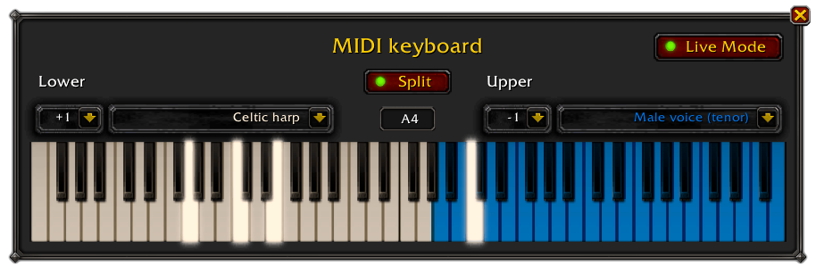

# MusicianMIDI
Play live with Musician using a MIDI keyboard.

As you may know, there is no way to use MIDI natively in World of Warcraft. MusicianMIDI doesn't work out of the box, it requires third party software to convert MIDI events coming from your MIDI keyboard into standard PC keystrokes that can be then processed by the add-on.

This step-by-step guide will explain how to install and configure all the required software, and how to resolve the most common problems you may encounter.

Feel free to join our [Discord server](https://discord.gg/ypfpGxK) for further assistance.

## Table of contents

- [Software installation](#software-installation)
- [Configuration for macOS (optional)](#configuration-for-macos-optional)
  1. [Function keys configuration](#1-function-keys-configuration)
  2. [Permissions](#2-permissions)
- [Configure your MIDI input device](#configure-your-midi-input-device)
  - [For Bome's MIDI Translator __Classic__](#for-bomes-midi-translator-classic)
  - [For Bome's MIDI Translator __Pro__](#for-bomes-midi-translator-pro)
- [How to play](#how-to-play)
- [Deal with audio delay in Microsoft Windows](#deal-with-audio-delay-in-microsoft-windows)
  - [Using a hardware synthesizer](#using-a-hardware-synthesizer)
  - [Using a software synthesizer](#using-a-software-synthesizer)
    1. [Install Sforzando](#install-sforzando)
    2. [Install FlexASIO (optional)](#install-flexasio-optional)
	3. [Configure Sforzando](#configure-sforzando)
    4. [Configure virtual MIDI cable (optional)](#configure-virtual-midi-cable-optional)
    5. [Play!](#play)

## Software installation
This add-on requires the external **Bome MIDI Translator** software to convert incoming MIDI messages from your controller into keystrokes that can be processed by the add-on.

Bome MIDI Translator exists in 2 versions :
* The **[Classic](https://www.bome.com/products/mtclassic)** version is the one that is **recommended** if you play on **Windows**. It's very simple and easy to use. It's a charged program for commercial use (€ 29) but you can use it for free without any limitation.
* The **[Pro](https://www.bome.com/products/miditranslator)** version is the only option if you play on **macOS**. It's more complex to use than the classic version. It costs € 59 but you can use the free trial version provided that you don't mind restarting it every 20 minutes.

You can also **request a free license** for the Classic or the Pro version by [sending a postcard to the developers](https://www.bome.com/postcardware).

## Configuration for macOS (optional)
Some extra configuration steps are required for the setup to properly work on macOS.

### 1. Function keys configuration
MusicianMIDI needs to the function keys to be enabled. Also make sure you don't have any shortcut using them.

1. Go to **System Preferences** > **Keyboard**.
2. Check **Use F1, F2, etc. keys as standard function keys**.

	

3. Go to the **Shortcuts** tab.
4. Click **Mission Control** and **uncheck** the **Show Desktop** shortcut if the **F11** key is set (default).

	

### 2. Permissions
Bome MIDI Translator needs accessibility permissions to send keystrokes.

1. Go to **System Preferences** > **Security & Privacy**.
2. Click on **Accessibility**.
3. Click on the padlock 🔒 to allow modifications.
4. Check **MIDI Translator Pro** in the list.

	

## Configure your MIDI input device

### For Bome's MIDI Translator __Classic__:
1. Connect your MIDI controller.
2. Start **Bome's MIDI Translator Classic**.
3. Open the `Musician preset.bmtp` file that is provided in the `Interface/AddOns/MusicianMIDI` folder.
4. Open the **Midi In** menu.
5. Select your MIDI input device.

	

### For Bome's MIDI Translator __Pro__:
1. Connect and turn on your MIDI controller.
2. Start **Bome's MIDI Translator Pro**.
3. Open the `Musician preset.bmtp` file that is provided in the `Interface/AddOns/MusicianMIDI` folder.
4. Open the **MIDI** menu option then click **Project Default MIDI Ports**.
5. Select your **MIDI INPUT** device in the right column under **MIDI IN Port**.

	

## How to play

In WoW, open Musician's menu by clicking on the minimap icon then choose **Open MIDI keyboard** or type `/mus midi`. You can play live using your MIDI keyboard as long as the MIDI keyboard window is focused in game.

The keyboard can be split in 2 layers to set a different instrument and/or octave on each side. Click the **Split** button to activate split mode. To change the split point, click on the split point text field then press the piano key you want as a new split point.

The keyboard can also be activated by clicking the on-screen keyboard keys.

Since MusicianMIDI relies on computer keyboard keystroke emulation, almost all the keyboard keys will trigger a note, including Esc, Enter and the function keys. The MIDI keyboard window should remain open and the WoW application focused to work. Click the **X** button to close the MIDI keyboard.

The piano keyboard range goes from E1 (28) to G7 (103) which corresponds to a standard 76-key piano. Playing out of range keys has no effect.

## Deal with audio delay in Microsoft Windows
As with the built-in live keyboard interface, you may experience some delay between the moment you press a key and when the sound actually starts playing, which can be awkward for a live performance.

This problem is more likely to occur on Microsoft Windows because WoW only supports Microsoft's legacy audio interface and is not compatible with the newer low latency interfaces used by music programs.

Mac users don't experience this problem because macOS was designed with music creation in mind.

Additional audio latency may also be caused by using wireless headphones or speakers. It's recommended that you use wired ones to reduce latency.

The solution is to use an external synthesizer for audio feedback, instead of relying on Musician's.

### Using a hardware synthesizer
The easiest way to play live without audio delay is to use a keyboard that has its own tone generator, such as a digital piano or a synthesizer. You can mute Musician's audio using the minimap icon and refer to your actual instrument's audio for playing.

### Using a software synthesizer
If your MIDI keyboard is a controller only – or if you just to play using Musician's instruments – you can run a software synthesizer on your computer along with Bome's MIDI Translator and use it for audio feedback.

#### Install Sforzando
The best soft synth you may use is [Sforzando](https://www.plogue.com/products/sforzando.html) because it's free and it supports Musician's soundfonts.

#### Install FlexASIO (optional)
On Windows, you need an **ASIO driver** in order to run Sforzando with no audio delay.

If you don't already have one that comes with some music software installed on your PC such as FL Studio, you can download and install [FlexASIO](https://github.com/dechamps/FlexASIO/releases) which is for free and open-source.

#### Configure Sforzando
To avoid issues, close any program that uses audio and MIDI before starting, including WoW and Bome's Midi Translator.

1. Launch **Sforzando**.
2. Click **Tools** > **Preferences**.
3. Under **Input MIDI Devices**, check the one that corresponds to your MIDI keyboard.
4. For **Audio Device API**, select **ASIO**.
5. For **Audio Device**, select your favorite ASIO driver such as **FlexASIO** or **FL Studio ASIO**.
6. Select the smallest **Buffer Size** possible for minimal delay (256 or 512 is good).
7. Leave the other parameters default (Stereo pair 1-2 and 48KHz).

	

8. Click **OK**.
9. Drag and drop any `.sfz` file from Musician's `soundfonts` folder into Sforzando.
10. Try playing on your MIDI keyboard, you should hear music.
11. Launch **Bome's Midi Translator** and a text editor such as Windows' Notepad. Play some notes around the middle C on your MIDI keyboard, it should type down letters in the text editor while you hear your instrument playing.

	⚠ If you get an error message such as **Cannot open MIDI input device**, this means your MIDI device can't be used simultaneously in 2 applications. Check the [Configure virtual MIDI cable](#configure-virtual-midi-cable-optional) section below to resolve this.

#### Configure virtual MIDI cable (optional)
Your MIDI controller may not be usable on several applications at the same time.

The trick is to configure Bome's Midi Translator to duplicate the incoming MIDI messages from your controller to Sforzando using a virtual MIDI cable.

1. Download and install [loopMIDI](https://www.tobias-erichsen.de/software/loopmidi.html).
2. Launch **loopMIDI**.
3. Right click on the loopMIDI tray icon  then check **Start minimized** and **Autostart loopMIDI** so you won't have to take care of it in the future.

	 

4. Click on **Configure loopMIDI** to open the main window.
5. In **New port-name**, type `MusicianMIDI Port` (or any other name you like) then press the  button.

	

6. Launch **Sforzando**. Click **Tools** > **Preferences**, uncheck your MIDI keyboard device then check **MusicianMIDI Port(in)**. Click **OK**.
7. Launch **Bome's Midi Translator**.
8. If not already done, set your MIDI keyboard as **MIDI IN** device as [explained earlier](#configure-your-midi-input-device).
9. Set your **MusicianMIDI Port** virtual cable as **MIDI OUT** device:

	In the __Classic__ version, click **Midi Out** then select **MusicianMIDI Port**.

	

	In the __Pro__ version, click **MIDI** > **Project Default MIDI Ports** then check **MusicianMIDI Port** under **MIDI OUTPUT**.

	

10. Load a .sfz file in Sforzando, open a text editor then press a few keys on your MIDI keyboard to check everything works as expected.

⚠ Make sure to use the latest version of the `Musician preset.bmtp` file bundled with the add-on and check the **MIDI Thru** preset is present and enabled.

#### Play!
1. Launch **Bome's MIDI Translator**.
2. Launch **Sforzando**.
3. Launch **WoW**.
4. Open the Musician MIDI keyboard window in game.
5. Mute Musician's audio using the minimap button.
6. Drag and drop the `.sfz` file that corresponds to the instrument you want to play from the Musician or MusicianExtended `soundfonts` folder into Sforzando.
7. Focus the MIDI keyboard window in WoW.
8. Enjoy!
